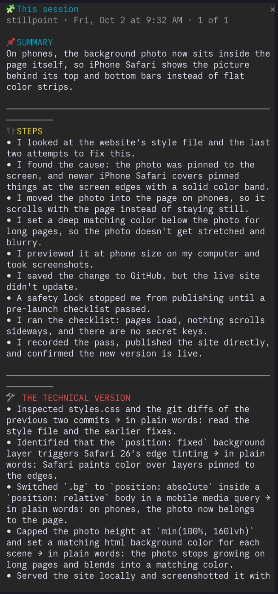

# Explain It

A [Claude Code](https://claude.com/claude-code) mod for people who build with Claude but don't come from a coding background.

After Claude changes files or runs commands, a small **Explain it** button appears above the prompt. Press it and a side panel walks you through what just happened:

- **Summary**: one sentence on what changed
- **Steps**: what was done, in plain English
- **The technical version**: the same steps the way an engineer would say them, each paired with its plain-English meaning
- **Why it matters** and **Do I need to do anything?**
- **Words to learn**: 2-4 real technical terms from the work. It remembers the words you've already learned and teaches new ones each time.



## Commands

| Command | What it does |
|---|---|
| `/explain-it` | Explain the latest work in this session |
| `/explain-it last` | Recap what Claude did in your previous session |
| `/explain-it history` | Reread saved explanations (◀ Older / Newer ▶) |

## Install

In Claude Code:

```
/plugin marketplace add ruthannbravo/explain-it
/plugin install explain-it@explain-it
/reload-plugins
```

Or from a terminal:

```
claude plugin marketplace add ruthannbravo/explain-it
claude plugin install explain-it@explain-it
```

## Privacy

Everything stays on your computer. Explain It keeps a short journal of each session (what you asked, which files changed, which commands ran) and your learned words in Claude Code's local plugin storage. Explanations are written by Claude in your own session, using your own Claude account. Nothing is sent anywhere else.

## License

MIT
